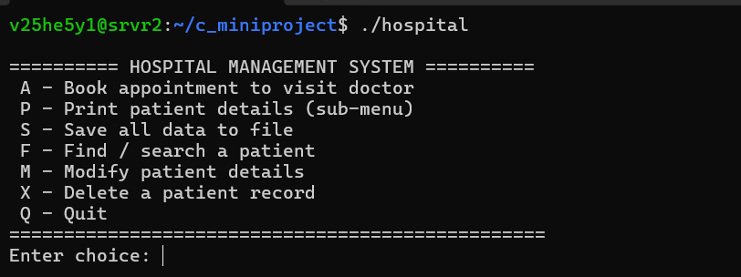
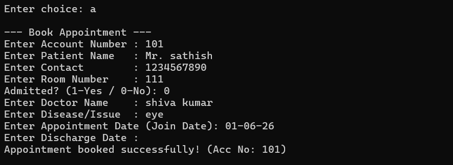
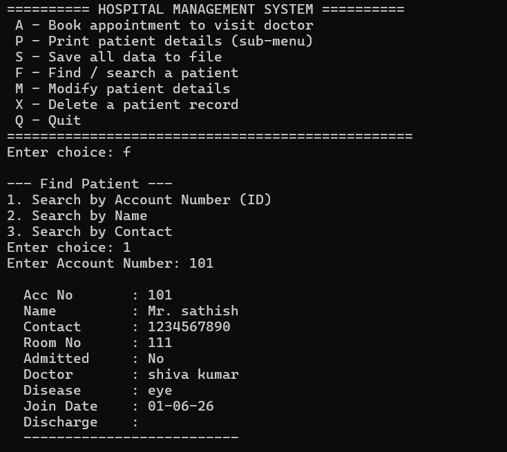

# 🏥 Hospital Management System in C


A console-based **Hospital Management System** developed using **C Programming**, **Structures**, **Singly Linked List (SLL)**, **File Handling**, and **Modular Programming**.

The project manages patient records, doctor appointments, account details, and persistent data storage.

---

## 📌 Features

✔ Create Patient Account  

✔ Book Doctor Appointment  

✔ Print Complete Patient Details  

✔ Print Specific Patient Details  

✔ Doctor-wise Patient Search  

✔ Disease-wise Patient Search  

✔ Search Patient Records  

✔ Modify Patient Information  

✔ Delete Patient Records  

✔ Save Data using File Handling  

✔ Duplicate Account Validation  

✔ Menu Driven Interface

---

## 🛠️ Technologies Used

- C Programming
- Structures
- Structure Pointers
- Singly Linked List (SLL)
- File Handling
- Makefile
- Modular Programming

---

## 📂 Project Structure

```text
Hospital-Management-System/
│
├── main.c
├── create_account.c
├── appointment.c
├── print.c
├── search.c
├── modify.c
├── delete.c
├── save.c
│
├── hospital.h
├── Makefile
├── patient_data.txt
│
└── README.md
```

---

## ⚙️ Workflow Diagram

```text
                   START
                     │
                     ▼
        ┌────────────────────────────┐
        │      Display Main Menu     │
        └────────────────────────────┘
                     │
     ┌───────────────┼──────────────────┐
     │               │                  │
     ▼               ▼                  ▼
Create Account   Book Appointment   Search Patient
     │               │                  │
     └───────────────┼──────────────────┘
                     ▼
         Print / Modify / Delete
                     │
                     ▼
             Save Data To File
                     │
                     ▼
                    EXIT
```

---

## 🚀 Compilation

Compile the project using:

```bash
make
```

---

## ▶ Run Application

```bash
./hospital
```

---

## 🖥️ Sample Menu

```text
------------------ MENU ------------------

A : Book Appointment

P : Print Patient Details

S : Save Data

F : Find Patient

M : Modify Patient Details

X : Delete Patient Record

Q : Quit Application
```

---

## 📸 Screenshots

### Main Menu



### Book Appointment



### Search Patient



## 💾 Data Storage Example

```text
Account No : 1001
Patient Name : Kumar
Doctor Name : Dr.Ramesh
Disease : Fever
Room Number : 203
Contact : 9876543210
Admission Status : YES
```

---

## 🔍 Core Functions

```c
Create_account();

Book_appointment();

Print_patient_details();

Search_patient();

Modify_patient();

Delete_patient();

Save_data();
```

---

## 🎯 Concepts Implemented

- Structures
- Structure Pointers
- Singly Linked List
- File Handling
- Duplicate Validation
- Dynamic Data Management
- Modular Programming
- Makefile Build System

---

## 🔮 Future Improvements

- Login Authentication
- Billing System
- Doctor Availability Tracking
- Database Integration
- GUI Version
- Admin Dashboard

---

## 👨‍💻 Author

**Shiva Kumar**

Embedded Systems | C Programming| C++ | Linux | IoT | ARM

GitHub: https://github.com/Shivakumaryenagurthi

---

## ⭐ Support

If you like this project, give it a **Star ⭐** on GitHub.
